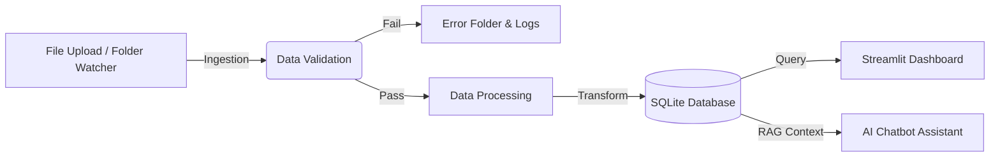

**Hệ thống Quản lý và Xử lý Dữ liệu Tự động cho Doanh nghiệp Nhỏ (SMB)**.  
Dự án tập trung vào việc xây dựng quy trình Data Engineering chuẩn mực: Từ thu thập, kiểm tra chất lượng, lưu trữ đến trực quan hóa và trợ lý ảo thông minh.

---

## 📖 Giới thiệu (Overview)

Trong các doanh nghiệp vừa và nhỏ (SMB), dữ liệu thường rời rạc ở nhiều định dạng (Excel, CSV) và được xử lý thủ công, dẫn đến sai sót và khó quản lý.

**SMB Data Hub** giải quyết bài toán này bằng cách cung cấp một **Pipeline tự động hóa**:
1.  **Ingestion:** Tự động phát hiện file mới được tải lên.
2.  **Validation:** Kiểm tra định dạng và chất lượng dữ liệu theo luật (Schema) định trước.
3.  **Processing:** Làm sạch và chuẩn hóa dữ liệu.
4.  **Storage:** Lưu trữ tập trung vào Data Warehouse (SQLite).
5.  **Serving:** Cung cấp Dashboard theo dõi và AI Chatbot để truy vấn số liệu.

---

## 🏗 Kiến trúc Hệ thống (Architecture)



---

## ✨ Tính năng Chính (Key Features)

* **🚀 Automated Ingestion:** Hệ thống "lắng nghe" thư mục upload. Chỉ cần nạp file, hệ thống tự chạy.
* **🛡️ Data Quality Gate:** Tự động chặn các file sai định dạng, thiếu cột hoặc dữ liệu rác.
* **🧠 Intelligent Routing:** Tự động nhận diện loại file (Ví dụ: File sinh viên, File bán hàng, File Telco) để áp dụng luật kiểm tra tương ứng.
* **📊 Real-time Dashboard:** Hiển thị trạng thái xử lý, tỷ lệ dữ liệu sạch/lỗi ngay lập tức.
* **🤖 AI Data Assistant:** Chatbot tích hợp **Azure OpenAI (RAG)** giúp sếp hỏi đáp về số liệu bằng ngôn ngữ tự nhiên (VD: "Doanh thu hôm nay thế nào?", "File vừa nạp có lỗi không?").
* **🧹 Auto-Cleanup & Reset:** Công cụ quản trị giúp làm sạch hệ thống chỉ với một nút bấm.

---

## 🛠️ Công nghệ Sử dụng (Tech Stack)

* **Ngôn ngữ:** Python 3.9+
* **Giao diện (Frontend):** Streamlit
* **Database:** SQLite (Embedded) + SQLAlchemy
* **Tự động hóa:** Watchdog (File System Monitoring)
* **Xử lý dữ liệu:** Pandas, OpenPyXL
* **AI/LLM:** Azure OpenAI Service (GPT-3.5/GPT-4)

---

## ⚙️ Cài đặt và Chạy (Installation)

### 1. Yêu cầu tiên quyết

* Cài đặt Python 3.9 trở lên.
* Tài khoản Azure OpenAI (Nếu muốn dùng tính năng AI Chatbot).

### 2. Cài đặt thư viện

```bash
pip install -r requirements.txt

```

### 3. Cấu hình

Tạo file `.env` ở thư mục gốc và điền thông tin:

```ini
# Database Config
DB_CONNECTION_STRING=sqlite:///smb_data_hub.db

# Azure OpenAI Config (Tùy chọn)
AZURE_OPENAI_ENDPOINT=https://<your-resource>[.openai.azure.com/](https://.openai.azure.com/)
AZURE_OPENAI_API_KEY=<your-api-key>
AZURE_OPENAI_DEPLOYMENT_NAME=gpt-35-turbo
AZURE_OPENAI_API_VERSION=2024-02-15-preview

```

### 4. Khởi chạy Hệ thống (Quan trọng)

Bạn cần mở **2 cửa sổ Terminal** riêng biệt để hệ thống hoạt động đầy đủ:

* **Terminal 1 (Backend - Xử lý ngầm):**
```bash
python src/ingestion/folder_watcher.py

```


*Màn hình hiện: "Đang giám sát thư mục..." là thành công.*
* **Terminal 2 (Frontend - Giao diện):**
```bash
streamlit run src/serving/dashboard.py

```

*Truy cập địa chỉ: http://localhost:8501*

---

## 📂 Cấu trúc Thư mục (Project Structure)

```text
smb_data_hub/
├── config/              # Cấu hình luật kiểm tra (settings.yaml)
├── data/                # Nơi lưu trữ file (Raw, Clean, Error, Uploads)
├── logs/                # File logs hệ thống
├── src/
│   ├── ingestion/       # Module theo dõi và upload file
│   ├── processing/      # Module xử lý, làm sạch dữ liệu
│   ├── validation/      # Module kiểm tra chất lượng (Schema check)
│   ├── storage/         # Module tương tác Database
│   ├── serving/         # Dashboard và Chatbot
│   └── pipeline/        # Luồng chạy chính (Main Flow)
├── .env                 # Biến môi trường (Bảo mật)
├── requirements.txt     # Các thư viện cần thiết
└── README.md            # Tài liệu dự án

```

---

## 🧪 Hướng dẫn Demo (Scenario)

1. **Trạng thái rỗng:** Mở Dashboard, thấy hệ thống sạch.
2. **Nạp file lỗi:** Upload file `ds_sv_loi.xlsx` (thiếu cột).
* *Kết quả:* Hệ thống báo lỗi, ghi log "FAILED", gửi cảnh báo.


3. **Nạp file chuẩn:** Upload file `telco_churn.csv` chuẩn.
* *Kết quả:* Hệ thống báo "SUCCESS", biểu đồ Dashboard cập nhật.


4. **Hỏi Chatbot:** Vào tab "Trợ lý dữ liệu" hỏi: *"Tình hình xử lý file vừa rồi thế nào?"*.
* *Kết quả:* Chatbot trả lời dựa trên dữ liệu thật vừa nạp.


5. **Reset:** Bấm nút "🗑️ Reset Toàn Bộ Hệ Thống" để xóa sạch dữ liệu demo.

---

## 👨‍💻 Tác giả

**[Nguyễn Hồng Phong - Bùi Phương Minh]** Sinh viên Kỹ thuật Dữ liệu - Học Viện Công Nghệ Bưu Chính Viễn Thông

Đồ án môn học: Đồ Án Ngành PTIT

```

```